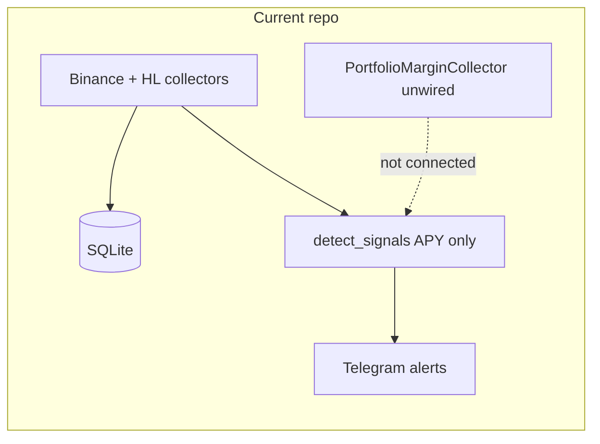
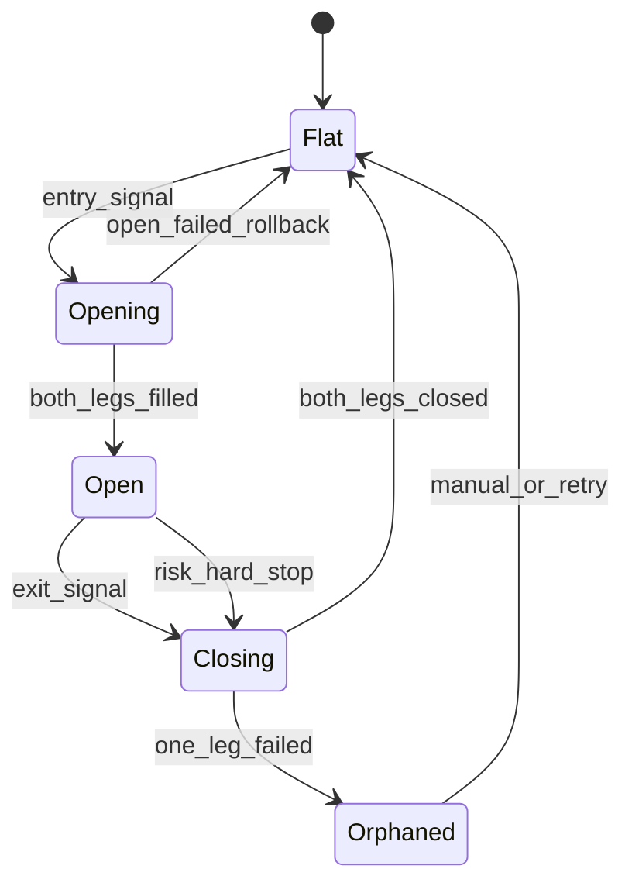
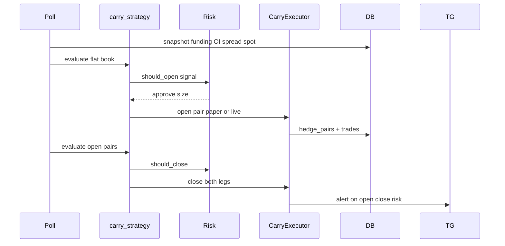

# Price Arb Implementation Plan — Day 1 Cash-and-Carry (Binance)

**Scope choice:** You selected **A — single-venue cash-and-carry** (long spot + short perp). Cross-exchange same-underlying and cross-underlying pairs remain Phase 2+; this plan designs hooks for them but does not implement them on Day 1.

**Deliverable file (after approval):** [`doc/plans/price-arb-cash-carry-day1.md`](doc/plans/price-arb-cash-carry-day1.md)

---

## What exists today



| Component | Status | Gap for carry |
|-----------|--------|----------------|
| [`src/fund_rate_arb/main.py`](src/fund_rate_arb/main.py) | Poll → APY signals → TG | No open/close lifecycle |
| [`src/fund_rate_arb/signal/detector.py`](src/fund_rate_arb/signal/detector.py) | Net APY vs threshold; `_calc_basis` uses **perp mark vs perp mid** | Not true spot–perp basis |
| [`src/fund_rate_arb/trading/engine.py`](src/fund_rate_arb/trading/engine.py) | PM market order; `position_side` hardcoded `LONG` | No spot leg, no paired hedge |
| [`src/fund_rate_arb/collectors/portfolio_margin.py`](src/fund_rate_arb/collectors/portfolio_margin.py) | CCXT papi orders/positions | No spot buy in product path |
| [`doc/plans/funding-rate-arbitrage-plan.md`](doc/plans/funding-rate-arbitrage-plan.md) | Full carry thesis + exit table | Mostly unimplemented |

Original plan exit ideas (funding collapse, basis compression, liquidation buffer) in Section 6 remain valid starting points.

**Execution mode (unset):** Default Day 1 to **paper / shadow ledger** (log intended legs + PnL) with optional flag for **small live PM** once paired open/close is proven. Confirm before live.

---

## Strategy definition (Day 1)

**Legs:** Long spot (or spot-margin equivalent in PM) + short perp, equal **USD notional**, low leverage (1–2x on perp).

**Edge:** Positive expected funding minus round-trip costs, adjusted for **basis at entry** (carry you pay/receive when opening).

**Not in Day 1:** HL execution, cross-venue inventory, pairs z-score trading.

---

## Question 1: When to close long and short?

Treat close as **simultaneous unwind of both legs** unless one leg is emergency-closed (risk event).

### Valid approaches (open design space)

| Approach | Close trigger | Pros | Cons |
|----------|---------------|------|------|
| **A. Edge exhaustion** | Net carry APY &lt; break-even threshold for N intervals | Aligns with why you opened | Lag; may give back funding |
| **B. Funding flip** | Predicted/last funding &lt; 0 (short pays long) | Fast protection from negative carry | Whipsaw in volatile regimes |
| **C. Basis target** | Basis converges to fair value or entry basis captured | Locks in carry PnL | Fair value hard in crypto perps |
| **D. Z-score / mean reversion** | Basis z-score returns to 0 (or ±0.5σ) | Quantifiable | Needs history; equity perps thin |
| **E. Time / expiry** | Max hold = 2× break-even days or fixed calendar | Simple backtest | Ignores live regime |
| **F. Risk stops** | Liquidation distance, margin ratio, vol spike | Survival | May exit at loss vs funding |
| **G. Profit target** | Cumulative PnL (funding + basis) &gt; X% of notional | Clear goal | May exit too early |
| **H. Structural break** | OI crash, ADL warning, exchange status | Tail risk | Noisy signals |

### Recommended Day 1 policy (composite)

Use a **priority-ordered exit evaluator** run every poll (8h on Binance) and on risk tick (1–5 min when live):

1. **Hard risk (immediate):** Perp liquidation buffer &lt; configured floor (e.g. 25% above maint margin) OR PM account not `NORMAL` → flatten both legs.
2. **Funding flip (fast):** `predicted_rate` and last settled rate both negative for short receiver → exit.
3. **Edge gone (primary):** `APY_net_7d` or rolling mean net carry &lt; `exit_apy_threshold` (e.g. 5%) for **2 consecutive** intervals → exit.
4. **Basis stop:** Basis moved **against** position by more than `basis_stop_bps` from entry (you paid too much contango or discount widened) → exit.
5. **Time stop:** Hold &gt; `max_hold_days` (e.g. 2× `break_even_days` from [`fee_model.py`](src/fund_rate_arb/scoring/fee_model.py)) → exit.
6. **Optional profit take:** Realized + unrealized carry &gt; `target_return_pct` → exit.

**Long leg close:** Sell spot (or reduce PM spot exposure). **Short leg close:** Buy to cover perp (`close_position` in PM collector). Both must succeed or enter **recovery mode** (alert + manual playbook).

**State machine (new module):**



Persist in [`positions`](src/fund_rate_arb/db.py) + new `hedge_pairs` table: `pair_id`, `symbol`, `spot_qty`, `perp_qty`, `entry_basis_bps`, `entry_apy_net`, `opened_at`, `status`.

---

## Question 2: Spot–futures spread (carry / basis) at open

### Valid ways to incorporate basis

| Method | Entry rule | Role of basis |
|--------|------------|---------------|
| **1. Filter only** | Open only if `APY_net &gt; threshold` AND `basis_bps &lt; max_entry_basis` | Avoid expensive contango entries |
| **2. Adjusted APY** | `APY_adj = APY_net - basis_cost_annualized` | Single score; needs amortization assumption |
| **3. Break-even bump** | Require extra funding days if basis &gt; 0 at entry | Conservative; matches original plan |
| **4. Fair value band** | `basis_fair = f(spot, rate, time)`; enter if `basis &gt; fair + edge` | Theoretically clean; needs rate curve |
| **5. Entry PnL budget** | `expected_funding_to_expiry &gt; fees + |basis| * notional` | Explicit one-trade economics |
| **6. Separate signal** | TG shows basis; human decides | Zero code risk | Not automatable |

### Recommended Day 1: **Filter + adjusted APY (lightweight)**

**True basis definition (fix current bug):**

```
basis_bps = (perp_mark - spot_index) / spot_index * 10000
```

- **Spot:** Binance spot/index or PM-equivalent mark (`index_price` from premiumIndex where available; add spot ticker fetch).
- **Perp:** `mark_price` from funding row (already in DB schema).

Reject or penalize entries when opening **long spot + short perp** in contango:

```
if basis_bps > max_entry_basis_bps:  # e.g. 30 bps
    skip  # paying too much premium to open

APY_adj = APY_net - (basis_bps / 10000) * (365 / expected_hold_days) * 100
if APY_adj < entry_apy_threshold:
    skip
```

**At open, store** `entry_basis_bps`, `entry_spot`, `entry_perp_mark` for exit rule #4.

### Day 1 required code/data changes

| Change | File / area |
|--------|-------------|
| Spot price collector (REST) | New method on [`binance.py`](src/fund_rate_arb/collectors/binance.py) or PM spot endpoint |
| Fix `_calc_basis` | [`signal/detector.py`](src/fund_rate_arb/signal/detector.py) — use spot index not perp mid |
| `basis_bps` on `Signal` + TG line | [`signal/detector.py`](src/fund_rate_arb/signal/detector.py), [`fund_rate_tg/models.py`](fund_rate_tg/src/fund_rate_tg/models.py) |
| Entry gate `should_open()` | New `src/fund_rate_arb/strategy/carry.py` |
| DB: optional `spot_prices` snapshots | [`db.py`](src/fund_rate_arb/db.py) |
| Config thresholds | [`config.py`](src/fund_rate_arb/config.py): `MAX_ENTRY_BASIS_BPS`, `EXIT_APY_THRESHOLD`, `BASIS_STOP_BPS` |

**Not Day 1:** Full fair-value curve, websocket orderbooks, cross-venue basis.

---

## Question 3: Risk management when market moves against you

### Valid practices

| Practice | What it protects | Day 1? |
|----------|------------------|--------|
| **Low leverage (1–2x)** | Liquidation on perp leg | Yes |
| **Margin buffer (2–4× maint)** | Gap moves before liquidation | Yes |
| **Delta rebalance band** | Spot vs perp notional drift | Phase 1b |
| **Kill switch** | Halt all new opens; flatten on command | Yes (env flag) |
| **Max notional / symbol / book** | Concentration | Yes (extend `RiskManager`) |
| **Funding reversal monitor** | Negative carry | Yes (exit #2) |
| **Volatility circuit breaker** | Realized vol &gt; X → no new risk / reduce | Phase 2 |
| **Mark–index divergence alert** | Manipulation / thin books | Phase 2 |
| **Exchange counterparty limit** | Single-venue for Day 1 reduces split risk | N/A |
| **Orphan leg playbook** | One leg fills, other fails | Yes (state `Orphaned`) |
| **ADL / OI shock** | Crowded unwind | Alert only Day 1 |

### Recommended Day 1 risk stack

Extend [`RiskManager`](src/fund_rate_arb/trading/engine.py):

- `max_concurrent_pairs`, `max_notional_per_symbol`, `max_book_notional`
- **Pre-trade:** `available_balance` covers spot + perp initial margin with buffer
- **Post-trade monitor:** `distance_to_liquidation_pct` from PM position API; alert &lt; 30%, flatten &lt; 15%
- **Directional stress (original plan §1.4):** If spot +X% and short perp −X%, perp loses margin — simulate **worst-case 24h move** vs buffer at open
- **Kill switch:** `TRADING_ENABLED=false` stops opens; `FLATTEN_ON_KILL=true` optional
- **Paper mode:** No real orders; write shadow fills to `trades` with `exchange=paper`

**Adverse scenario playbook:**

| Scenario | Action |
|----------|--------|
| Strong rally, short perp underwater | Do not add leverage; if liq buffer breached → close **both** (do not hold naked long) |
| Funding flips negative | Exit per exit #2 |
| Basis blows out | Exit per basis stop |
| Spot fill fails, perp filled | Orphan → immediate perp close attempt + alert |
| API / account degraded | No new trades; optional flatten |

---

## Implementation phases

### Phase 0 — Foundation (Day 1a, no live orders)

1. Spot index fetch + true `basis_bps` in detector and TG.
2. `strategy/carry.py`: `should_open()`, `should_close()`, `APY_adj`.
3. `hedge_pairs` schema + position state machine (Flat/Open/Closing).
4. Paper executor: log paired open/close with fees from [`fee_model.py`](src/fund_rate_arb/scoring/fee_model.py).
5. CLI: `carry-status`, `carry-paper-open`, `carry-paper-close` (or extend existing CLI).

### Phase 1 — Paired execution (Day 1b, after paper validation)

1. `CarryExecutor`: spot buy then perp short (or atomic sequence with rollback).
2. Wire `TradingEngine` to **SHORT** perp + spot long; fix symbol mapping (`TSLAUSDT`).
3. Exit loop in [`main.py`](src/fund_rate_arb/main.py) or dedicated worker: evaluate open positions each funding tick.
4. TG alerts on exit signals and risk breaches.

### Phase 2 — Later (your broader vision)

- Cross-exchange same underlying (BN vs HL marks + funding diff).
- Cross-underlying pairs (cointegration / z-score).
- WebSockets, ClickHouse, execution in Rust/Go per original roadmap.

---

## Key process flow (target)



---

## Testing

- Unit: `should_open` / `should_close` with fixture basis and funding series.
- Integration: paper round-trip on mocked PM + spot prices.
- Reuse [`tests/test_portfolio_margin.py`](tests/test_portfolio_margin.py) patterns for live PM (optional, gated).

---

## Open items for you

1. **Execution mode:** paper-only vs small live PM for Phase 1b.
2. **Universe:** keep equity perp whitelist in [`config.py`](src/fund_rate_arb/config.py) or expand.
3. **Threshold defaults:** e.g. entry APY 15%, exit APY 5%, max entry basis 30 bps — confirm or tune from history.

---

## Summary answers (decisions)

| Question | Day 1 solution |
|----------|----------------|
| **1. Close conditions** | Priority stack: hard liq → funding flip → edge gone (2 intervals) → basis stop → time stop → optional profit target; always close **both** legs |
| **2. Basis at open** | True spot–perp `basis_bps`; max entry basis filter + `APY_adj`; store entry basis for exit |
| **3. Risk when wrong way** | 1–2x leverage, margin buffer, kill switch, notional limits, liq distance flatten, orphan playbook, paper first |
