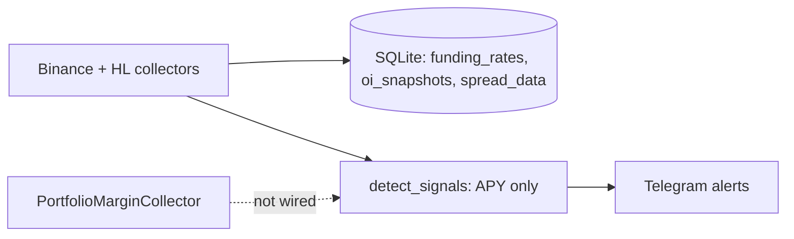
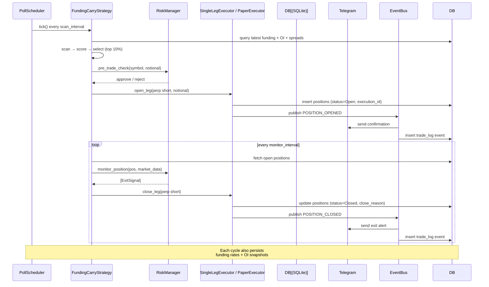

# Funding Rate Arbitrage — Implementation Plan v3

> **Revision:** Merges cash-carry arb plan (abfd34c0) + critical architecture review + 4 open-source repo analysis
> **Strategy:** Multi-strategy framework, FundingCarry first (single-leg perp short on Binance PM)
> **Execution:** Binance PM (Phase 1), Hyperliquid + cross-exchange dual-leg (Phase 2)
> **Mode:** Paper/shadow first → small live PM after validation

---

## Architecture Overview

```
                     ┌──────────────────────────────────────┐
                     │    CLI / Server Entry (main.py)       │
                     ├──────────────────────────────────────┤
                     │  Strategy Engine (extends PollScheduler)│
                     │  ┌────────────────────────────────┐   │
                     │  │ FundingCarryStrategy           │   │
                     │  │  scan → select → execute       │   │
                     │  │  → monitor → persist → tick    │   │
                     │  └────────────────────────────────┘   │
                     ├──────────────────────────────────────
   New packages →    │ strategies/  execution/  data/  risk/ │
                     │ events/                               │
                     ├──────────────────────────────────────┤
   Existing →        │ Scoring   Signal   collectors/  models│
   (reused)          │ db.py     config.py  tg/              │
                     ├──────────────────────────────────────┤
   New →             │ trade_log table (correlated events)   │
                     │ Funding payment tracker               │
                     │ Position state machine (Flat/Open/..  │
                     ──────────────────────────────────────┘
```

**Key architectural decisions:**

| Decision | Why | Source |
|----------|-----|--------|
| Single-leg perp short on Binance (Phase 1) | Stock perps exist ONLY on fapi.binance.com. No spot leg. Carry = funding income from short. | Research |
| Paper/shadow mode first | Log intended positions + simulated PnL before live orders. Validate exit rules. | cash-carry plan |
| Trade log with `execution_id` | Correlate open/close/funding events per position. Attribute PnL. | 50shadesofgwei |
| `retry_with_backoff` on every API call | Transient failures WILL happen live. | 50shadesofgwei |
| Triple-barrier exit (TP/SL/time) | Most robust exit model found in production code. | Hummingbot |
| Funding payment tracking | Expected vs realized PnL differs. Must track actual payments per position. | Hummingbot |
| Position state machine (Flat/Open/Closing/Orphaned) | Explicit lifecycle. Orphaned state for one-leg-fail recovery. | cash-carry plan |
| Event bus (pub/sub) | Decouples strategies, execution, risk, alerts. | 50shadesofgwei |
| Liquidation proximity check | Binance PM uses mark price for liquidation. Must monitor distance. | 50shadesofgwei |
| Profitability gate before entry | Don't enter if fees > expected funding profit. | Hummingbot |
| DB: ALTER TABLE, not CREATE TABLE | Extend existing `positions` and `trades`. One new `trade_log` table only. | Review |
| Extend `PollScheduler` | Don't create duplicate scheduler. | Review |

**Package responsibilities:**

| Package | Purpose | Status |
|---------|---------|--------|
| `strategies/` | BaseStrategy ABC, FundingCarryStrategy, StrategySpec config | New |
| `execution/` | Executor ABC, retry_with_backoff, position allocator, paper executor | New |
| `data/` | Time-series retriever, sliding window monitors, funding payment tracker | New |
| `risk/` | Unified RiskManager, ExitRuleEngine, liquidation monitor | New |
| `events/` | Simple pub/sub event bus | New |
| `scoring/` | persistence, fee_model, quality_score | Reuse |
| `collectors/` | binance, hyperliquid, portfolio_margin, base | Reuse |
| `signal/` | detector (alerts), scheduler (extended with run_strategy) | Reuse + extend |
| `tg/` | Telegram sender, alert templates | Reuse + extend |
| `models/` | funding.py + CarryPosition, ExitSignal, HedgePair | Extend |
| `db.py` | Existing tables + new columns + trade_log + queries | Extend |
| `config.py` | Settings loader, Underlying, StrategySpec loader | Extend |

---

## Data Flow: From Existing to Target

### Current Flow (what exists)



**Gaps for carry:**
- `Detector` only checks net APY vs threshold. No open/close lifecycle.
- `PortfolioMarginCollector` exists but unwired to strategy.
- `trading/engine.py` only closes LONG positions — no spot leg, no paired hedge.
- `_calc_basis` in `detector.py` uses perp mark vs perp mid — **not true basis**.

### Target Flow (after v3)



---

## Core Corrections from Prior Plans

### 1. FundingCarry = Single-Leg Perp Short on Binance

**Prior plan mistake:** Assumed dual-leg (spot long + perp short) on Binance.

**Reality:** Binance stock perps exist ONLY on `fapi.binance.com`. No `TSLA/USDT` spot pair exists. The "carry" comes from shorting the perp and collecting funding payments. The index price (`index_price` from `/fapi/v1/premiumIndex`) is Binance's composite spot reference — no separate spot collector needed.

**Phase 1:** `BinanceSingleLegExecutor` — perp short only. No spot leg.

**Phase 2:** `DualLegExecutor` with compensating transactions for cross-exchange scenarios (long spot on CEX A, short perp on CEX B).

### 2. Basis = Mark vs Index (Not Spot)

**Prior plan mistake:** Basis = perp_mark - spot_mid.

**Fix:** Basis = `(mark_price - index_price) / index_price * 10000` bps. Both values come from `/fapi/v1/premiumIndex` which is already collected by `BinanceCollector.fetch_funding_rates()` and stored in the `funding_rates` table. `signal/detector.py` `_calc_basis` already computes this — just need to verify the formula matches.

### 3. Paper Mode First

From cash-carry plan: **Day 1 = paper/shadow ledger**. Log intended positions + simulated PnL in DB with `exchange=paper`. Validate exit rules and risk logic before touching live orders.

```python
class PaperExecutor(BaseExecutor):
    """Logs intended trades to DB with exchange='paper'. No real orders."""
    async def open_leg(self, symbol, side, notional_usdt, order_type="market"):
        # 1. Fetch current price
        # 2. Simulate fill at mid price
        # 3. Deduct simulated fees
        # 4. Record to positions table (status=Open) + trade_log
```

### 4. DB: Extend, Don't Duplicate

**New columns on existing tables:**

```sql
-- positions table additions
ALTER TABLE positions ADD COLUMN strategy_name TEXT;
ALTER TABLE positions ADD COLUMN entry_basis REAL DEFAULT 0;
ALTER TABLE positions ADD COLUMN cumulative_funding REAL DEFAULT 0;
ALTER TABLE positions ADD COLUMN max_break_even_days INTEGER DEFAULT 10;
ALTER TABLE positions ADD COLUMN close_reason TEXT;
ALTER TABLE positions ADD COLUMN execution_id TEXT;       -- UUID, correlates open/close/funding events

-- trades table additions
ALTER TABLE trades ADD COLUMN strategy_name TEXT;
ALTER TABLE trades ADD COLUMN execution_id TEXT;          -- links to position
ALTER TABLE trades ADD COLUMN event_type TEXT;            -- 'open' | 'close' | 'funding_payment' | 'retry_failed'

-- NEW: trade_log table (audit trail, from 50shadesofgwei pattern)
CREATE TABLE trade_log (
    id INTEGER PRIMARY KEY,
    execution_id TEXT NOT NULL,
    strategy_name TEXT NOT NULL,
    symbol TEXT NOT NULL,
    event TEXT NOT NULL,                  -- 'open', 'close', 'funding', 'retry', 'alert', 'compensating_close'
    timestamp TEXT NOT NULL,
    details TEXT,                          -- JSON payload
    UNIQUE(execution_id, event, timestamp)
);
```

### 5. Scheduler: Extend PollScheduler

**Prior plan mistake:** New `StrategyEngine` separate from `PollScheduler`.

**Fix:** Add `run_strategy()` method to existing `PollScheduler`:

```python
class PollScheduler:
    async def run_strategy(self, strategy: BaseStrategy, interval: int) -> None:
        """Run strategy.tick() at interval."""
        while self._running:
            try:
                await strategy.tick()
            except Exception:
                logger.exception("Strategy tick failed: %s", strategy.name)
            await asyncio.sleep(interval)
```

### 6. Exit Rules: Configurable Per Strategy

All thresholds defined in `settings.yaml` per strategy. No hardcoded values in code.

---

## 1. Strategy Framework (`strategies/`)

### 1.1 Config Models (`strategies/config.py`)

Pydantic models loaded from `settings.yaml` `strategies:` section:

```python
@dataclass
class SelectionConfig:
    top_pct: float = 10.0           # top N% of scored candidates
    min_apy: float = 10.0           # minimum APY% to consider
    max_break_even_days: int = 10

@dataclass
class ExecutionConfig:
    max_concurrent: int = 5
    max_per_position_usdt: float = 200.0
    max_portfolio_pct: float = 80.0
    retry_max: int = 5
    retry_base_delay_s: float = 2.0
    paper_mode: bool = True         # Day 1: paper/shadow only

@dataclass
class ExitRuleConfig:
    type: str                       # funding_collapse, consecutive_negative, basis_drift, ...
    params: dict[str, Any]          # type-specific thresholds

@dataclass
class AnomalyConfig:
    oi_spike_window_h: int = 8
    oi_spike_threshold_pct: float = 20.0
    funding_shift_stdev_mult: float = 2.0
    funding_shift_baseline_days: int = 7

@dataclass
class StrategySpec:
    name: str
    enabled: bool
    scan_interval_s: int = 3600     # hourly scan
    weights: dict[str, float]       # override global scoring weights
    fees: dict[str, float]          # override global fees
    selection: SelectionConfig
    execution: ExecutionConfig
    exit_rules: list[ExitRuleConfig]
    anomaly: AnomalyConfig
```

### 1.2 Base Strategy (`strategies/base.py`)

```python
class BaseStrategy(ABC):
    @property
    @abstractmethod
    def name(self) -> str: ...

    @abstractmethod
    async def scan(self, config: StrategySpec) -> list[FundingScore]:
        """Query data, compute scores, return sorted list (best first)."""

    @abstractmethod
    def select(self, scores: list[FundingScore], config: StrategySpec) -> list[FundingScore]:
        """Filter + rank to allocation candidates."""

    @abstractmethod
    async def execute(self, candidates: list[FundingScore], allocator: PositionAllocator,
                      executor: BaseExecutor) -> list[CarryPosition]:
        """Open positions. Handle retry, compensating transactions."""

    @abstractmethod
    async def monitor(self, positions: list[CarryPosition], risk_mgr: RiskManager,
                      market_data: MarketData) -> list[ExitSignal]:
        """Check risk conditions. Return exit signals."""

    async def tick(self, config: StrategySpec) -> None:
        """Full cycle: scan → select → execute → monitor → persist."""
```

### 1.3 FundingCarryStrategy (`strategies/funding_carry.py`)

**Scan:**
1. Query latest funding rates + OI + spreads from DB
2. For each symbol: `compute_quality_score()` → filter regime="bull", break_even_days <= max
3. Return sorted by score descending

**Select:**
1. Rank by `estimated_apy / break_even_days` (return per day to breakeven)
2. Take top `top_pct`% (e.g., top 10%)
3. Apply profitability gate: expected net funding > entry+exit fees

**Execute (per candidate):**
1. Allocate notional via `PositionAllocator`
2. Open perp short via `BinanceSingleLegExecutor` (or `PaperExecutor` in paper mode)
3. Retry up to `retry_max` with exponential backoff
4. On fill: record position with `entry_basis` (mark-index), `entry_cost`, `execution_id` (UUID)
5. On failure after retries: log event, send TG alert, skip
6. Persist funding rates + OI to DB

**Monitor:**
1. Fetch open positions from DB
2. For each position: run all exit rules via `ExitRuleEngine`
3. On critical signal: close position, log event, send TG alert
4. Update `cumulative_funding` for positions receiving funding payments

---

## 2. Execution Layer (`execution/`)

### 2.1 Executor (`execution/base.py`)

```python
class BaseExecutor(ABC):
    @property
    @abstractmethod
    def exchange_name(self) -> str: ...

    @abstractmethod
    async def open_leg(self, symbol: str, side: str, notional_usdt: float,
                       order_type: str = "market") -> OrderResult: ...

    @abstractmethod
    async def close_leg(self, symbol: str, side: str, amount: float) -> OrderResult: ...

    @abstractmethod
    async def get_positions(self) -> list[ExchangePosition]: ...
```

### 2.2 Binance Single-Leg Executor (`execution/binance.py`)

Wraps `PortfolioMarginCollector`. For FundingCarry Phase 1: perp short only.

```python
class BinanceSingleLegExecutor(BaseExecutor):
    @property
    def exchange_name(self) -> str: return "binance_pm"

    async def open_leg(self, symbol, side, notional_usdt, order_type="market"):
        # 1. Fetch current mark price via PortfolioMarginCollector
        # 2. notional_to_contracts(notional, price, contract_size) → int
        # 3. Place market order via PortfolioMarginCollector.place_order()
        # 4. Verify fill (filled >= 90% of requested)
        # 5. Record to trade_log: event='open'
        # 6. Return OrderResult
```

### 2.3 Paper Executor (`execution/paper.py`)

From cash-carry plan: shadow ledger for Day 1 validation.

```python
class PaperExecutor(BaseExecutor):
    @property
    def exchange_name(self) -> str: return "paper"

    async def open_leg(self, symbol, side, notional_usdt, order_type="market"):
        # 1. Fetch current price from DB or collector
        # 2. Simulate fill at mid price
        # 3. Deduct simulated fees (maker + taker + slippage)
        # 4. Record to positions table (exchange='paper', status='Open')
        # 5. Record to trade_log: event='open'
```

### 2.4 Dual-Leg Executor (`execution/dual_leg.py`) — Phase 2

For cross-exchange scenarios with compensating transactions:

```python
class DualLegExecutor(BaseExecutor):
    async def open_dual_leg(self, long_leg_spec, short_leg_spec) -> DualLegResult:
        # 1. Open long leg (e.g., spot on CEX A)
        # 2. If long succeeds but short fails after retries:
        #    → immediately market-close long leg (compensating transaction)
        #    → log execution_id, event='compensating_close'
        #    → return DualLegResult(success=False, reason='short_leg_failed')
        # 3. If both succeed: log both legs with same execution_id
        #    → return DualLegResult(success=True)
```

### 2.5 Retry (`execution/retry.py`)

Based on 50shadesofgwei `deco_retry` pattern:

```python
async def retry_with_backoff(
    fn: Callable,
    max_retries: int = 5,
    base_delay_s: float = 2.0,
    max_delay_s: float = 30.0,
    retryable_errors: tuple[type] = (httpx.HTTPError, ccxt.NetworkError, ccxt.RateLimitExceeded),
) -> Any:
    """Exponential backoff. Logs each retry attempt."""
    delay = base_delay_s
    for attempt in range(1, max_retries + 1):
        try:
            return await fn()
        except retryable_errors as e:
            if attempt == max_retries:
                raise
            logger.warning("Retry %d/%d after %s: %s", attempt, max_retries, delay, e)
            await asyncio.sleep(delay)
            delay = min(delay * 2, max_delay_s)
```

### 2.6 Position Allocator (`execution/allocator.py`)

```python
class PositionAllocator:
    def __init__(self, portfolio_usdt: float, max_per_position_usdt: float,
                 max_portfolio_pct: float = 80.0, max_concurrent: int = 5): ...

    def allocate(self, candidates: list[FundingScore],
                 open_positions: list[CarryPosition]) -> dict[str, float]:
        """Returns {symbol: notional_usdt} for positions to open."""
        remaining = self.portfolio_usdt * (self.max_portfolio_pct / 100)
        # Subtract already-allocated notional from open positions
        allocated = sum(p.notional_usdt for p in open_positions)
        remaining -= allocated
        slots = min(len(candidates), self.max_concurrent - len(open_positions))
        if slots <= 0:
            return {}
        per_slot = remaining / slots
        return {
            c.symbol: min(per_slot, self.max_per_position_usdt)
            for c in candidates[:slots]
        }
```

---

## 3. Data Layer (`data/`)

### 3.1 Time-Series Retriever (`data/retriever.py`)

```python
def query_funding_window(db_path: str, symbol: str, exchange: str, hours: int) -> list[float]:
    """Return funding rates in the last N hours, oldest first."""

def query_oi_window(db_path: str, symbol: str, exchange: str, hours: int) -> list[float]:
    """Return OI snapshots in the last N hours."""

def query_latest_basis(db_path: str, symbol: str, exchange: str = "binance") -> float | None:
    """Return current basis (mark - index) / index from funding_rates table."""

def query_cumulative_funding(db_path: str, execution_id: str) -> float:
    """Sum of all funding_payment events for this position."""

def query_position_state(db_path: str, execution_id: str) -> PositionState | None:
    """Return position status, entry_basis, cumulative_funding, opened_at."""
```

### 3.2 Sliding Window Monitors (`data/monitors.py`)

```python
@dataclass
class MonitorResult:
    triggered: bool
    metric: str
    current_value: float
    threshold: float
    message: str

def detect_oi_spike(oi_window: list[float], threshold_pct: float = 20.0) -> MonitorResult:
    """|oi_now - oi_8h_ago| / oi_8h_ago > threshold."""

def detect_funding_regime_shift(current_window: list[float], baseline_window: list[float],
                                 stdev_multiplier: float = 2.0) -> MonitorResult:
    """std(current) / std(baseline) > multiplier → regime shift."""

def compute_funding_zscore(current: float, window: list[float]) -> float:
    """z = (current - mean) / std. |z| > 3 = outlier."""

def compute_ewma(values: list[float], span: int = 12) -> float:
    """Exponential weighted moving average for funding rate smoothing."""

def compute_basis_drift(current_mark: float, current_index: float,
                        entry_basis: float) -> float:
    """abs((mark - index) / index - entry_basis)."""

def compute_notional_drift(spot_price: float, perp_price: float,
                           entry_notional: float) -> float:
    """abs(spot_notional - perp_notional) / entry_notional. For dual-leg rebalance."""
```

### 3.3 Funding Payment Tracker (`data/payments.py`)

From Hummingbot: track actual funding payments, not just expected rates.

```python
@dataclass
class FundingSummary:
    total_payments: float       # sum of all funding received
    count: int
    average_rate: float
    last_payment_ts: str | None

def record_funding_payment(db_path: str, execution_id: str, symbol: str,
                           rate: float, amount: float, timestamp: str) -> None:
    """Record actual funding payment received for a position."""
    # Insert into trade_log: event='funding', details={rate, amount}
    # Update positions.cumulative_funding

def query_position_funding_summary(db_path: str, execution_id: str) -> FundingSummary:
    """Sum of payments, count, average rate, last payment time."""
```

**How payments are detected:** Query `/papi/v1/um/income` (Binance PM income history) for `incomeType=FUNDING_FEE`. Match by symbol and timestamp to attribute to open positions.

---

## 4. Risk Engine (`risk/`)

### 4.1 RiskManager (`risk/manager.py`)

Two layers: pre-trade and per-cycle monitoring.

**Pre-trade checks** (before entering):

| Check | Condition | Action |
|-------|-----------|--------|
| Balance | `available_balance >= notional * 2` | Pass/fail |
| Profitability gate | `expected_net_funding > entry_fees + exit_fees` | Pass/fail |
| Symbol validity | Symbol in whitelist AND in exchange exchangeInfo | Pass/fail |
| Max concurrent | `open_positions < max_concurrent` | Pass/fail |
| Re-entry cooldown | `last_close_ts > 6h ago` for this symbol | Pass/fail |
| Kill switch | `TRADING_ENABLED=true` env var | Pass/fail |

**Per-cycle checks** (monitoring open positions):

| Check | Condition | Severity | Action |
|-------|-----------|----------|--------|
| Liquidation proximity | `distance_to_liq < min_distance_pct` | warning | TG alert |
| Liquidation critical | `distance_to_liq < 15%` | critical | Flatten both legs |
| Concentration | >30% portfolio in one sector | warning | Block new entries |
| Account status | PM account != NORMAL | critical | Flatten all positions |

```python
@dataclass
class RiskConfig:
    max_basis_drift_pct: float = 1.0
    max_break_even_days: int = 10
    funding_collapse_window_h: int = 48
    funding_consecutive_negatives: int = 3
    oi_spike_threshold_pct: float = 20.0
    oi_spike_window_h: int = 8
    min_distance_to_liq_pct: float = 10.0   # warning threshold
    critical_distance_to_liq_pct: float = 15.0  # flatten threshold
    max_sector_concentration_pct: float = 30.0
    reentry_cooldown_h: int = 6

class RiskManager:
    def __init__(self, config: RiskConfig, db_path: str): ...

    def pre_trade_check(self, symbol: str, notional: float, expected_apy: float,
                        open_positions: list[CarryPosition]) -> RiskResult: ...

    def monitor_position(self, position: CarryPosition, market_data: MarketData) -> list[ExitSignal]: ...

    def check_liquidation_proximity(self, position: CarryPosition) -> ExitSignal: ...
```

### 4.2 Exit Rules (`risk/exit_rules.py`)

From Hummingbot triple-barrier + 50shadesofgwei liquidation check + cash-carry plan exit stack:

| Rule | Trigger | Severity | Source |
|------|---------|----------|--------|
| liquidation_critical | distance_to_liq < 15% | critical | 50shadesofgwei |
| account_abnormal | PM account != NORMAL | critical | cash-carry |
| funding_flip | predicted_rate < 0 AND last settled < 0 | critical | cash-carry |
| consecutive_negative | N consecutive negative intervals | critical | v2 |
| basis_drift | abs(current_basis - entry_basis) > max_drift_pct | critical | v2 |
| break_even_deadline | max_days reached, funding < entry_cost | critical | v2 |
| break_even_projection | projected days > remaining days | warning | v2 |
| funding_collapse | 48h EMA funding < threshold | warning | v2 |
| drawdown_realized | cumulative realized losses > max_loss_pct | critical | Hummingbot |
| symbol_delisted | symbol not in exchange exchangeInfo | critical | Review |
| negative_carry | funding income < fees per day | warning | Review |
| reentry_cooldown | last close < cooldown_h ago | info | v2 |

**Priority-ordered exit evaluator** (run every monitor cycle):

1. **Hard risk (immediate):** Liquidation buffer < 15% OR PM account abnormal → flatten immediately
2. **Funding flip (fast):** Predicted AND last settled rate both negative → exit
3. **Consecutive negative (fast):** N consecutive negative intervals → exit
4. **Basis drift (primary):** abs(current_basis - entry_basis) > max_drift_pct → exit
5. **Edge gone:** 48h EMA funding < threshold for 2 consecutive intervals → exit
6. **Time stop:** Hold > max_break_even_days → exit
7. **Optional profit take:** Cumulative funding > target_return_pct → exit

```python
@dataclass
class ExitSignal:
    position_execution_id: str
    rule_type: str            # matches ExitRuleConfig.type
    severity: str             # 'info' | 'warning' | 'critical'
    message: str

    @staticmethod
    def none() -> ExitSignal:
        return ExitSignal("", "info", "")

class ExitRuleEngine:
    def __init__(self, rules: list[ExitRuleConfig]): ...

    def evaluate_all(self, position: CarryPosition, market_data: MarketData) -> list[ExitSignal]:
        """Run all rules in priority order. Return sorted by severity (critical first)."""
```

**Severity escalation:** `info` → log only, `warning` → prepare exit + TG alert, `critical` → immediate market close.

---

## 5. Event Bus (`events/`)

From 50shadesofgwei `EventsDirectory` pattern. Simple in-memory pub/sub:

```python
class EventBus:
    def __init__(self):
        self._handlers: dict[str, list[Callable]] = defaultdict(list)

    def subscribe(self, event_type: str, handler: Callable) -> None:
        self._handlers[event_type].append(handler)

    def publish(self, event_type: str, payload: dict) -> None:
        for handler in self._handlers.get(event_type, []):
            try:
                handler(payload)
            except Exception:
                logger.exception("Event handler failed: %s", event_type)
```

**Events:**

| Event | Payload | Handlers |
|-------|---------|----------|
| `POSITION_OPENED` | `{execution_id, symbol, side, notional, entry_basis}` | Update DB, TG confirmation, trade_log |
| `POSITION_CLOSED` | `{execution_id, symbol, reason, pnl, hold_days}` | Update DB, TG alert, trade_log |
| `EXIT_TRIGGERED` | `{execution_id, symbol, rule_type, severity, message}` | TG alert (deduped) |
| `RETRY_FAILED` | `{symbol, side, attempt, error}` | TG alert |
| `ANOMALY_DETECTED` | `{symbol, metric, value, threshold}` | Log, optional TG |
| `COMPENSATING_CLOSE` | `{execution_id, symbol, reason}` | trade_log, TG alert |
| `FUNDING_PAYMENT` | `{execution_id, symbol, rate, amount}` | Update cumulative_funding |

---

## 6. Database (`db.py`)

### 6.1 Schema Migration

All additions via `ALTER TABLE` + one new table. Idempotent (safe to re-run).

```sql
-- positions table additions
ALTER TABLE positions ADD COLUMN IF NOT EXISTS strategy_name TEXT;
ALTER TABLE positions ADD COLUMN IF NOT EXISTS entry_basis REAL DEFAULT 0;
ALTER TABLE positions ADD COLUMN IF NOT EXISTS cumulative_funding REAL DEFAULT 0;
ALTER TABLE positions ADD COLUMN IF NOT EXISTS max_break_even_days INTEGER DEFAULT 10;
ALTER TABLE positions ADD COLUMN IF NOT EXISTS close_reason TEXT;
ALTER TABLE positions ADD COLUMN IF NOT EXISTS execution_id TEXT;

-- trades table additions
ALTER TABLE trades ADD COLUMN IF NOT EXISTS strategy_name TEXT;
ALTER TABLE trades ADD COLUMN IF NOT EXISTS execution_id TEXT;
ALTER TABLE trades ADD COLUMN IF NOT EXISTS event_type TEXT;

-- NEW: trade_log table
CREATE TABLE IF NOT EXISTS trade_log (
    id INTEGER PRIMARY KEY,
    execution_id TEXT NOT NULL,
    strategy_name TEXT NOT NULL,
    symbol TEXT NOT NULL,
    event TEXT NOT NULL,
    timestamp TEXT NOT NULL,
    details TEXT,
    UNIQUE(execution_id, event, timestamp)
);
CREATE INDEX IF NOT EXISTS idx_trade_log_execution ON trade_log(execution_id);
CREATE INDEX IF NOT EXISTS idx_trade_log_event ON trade_log(event);
```

### 6.2 New Query Functions

```python
def query_oi_history(db_path: str, symbol: str, exchange: str, hours: int) -> list[dict]: ...
def query_funding_range(db_path: str, symbol: str, exchange: str, start_ts: str, end_ts: str) -> list[dict]: ...
def insert_strategy_position(db_path: str, row: tuple) -> str:       # returns execution_id (UUID)
def update_position_funding(db_path: str, execution_id: str, cumulative: float) -> None: ...
def close_strategy_position(db_path: str, execution_id: str, reason: str) -> None: ...
def insert_trade_log(db_path: str, execution_id: str, strategy: str, symbol: str,
                     event: str, details: str | None) -> None: ...
def query_trade_log(db_path: str, execution_id: str) -> list[dict]: ...
def query_open_positions_by_strategy(db_path: str, strategy_name: str) -> list[dict]: ...
def query_last_close_time(db_path: str, symbol: str, strategy_name: str) -> str | None: ...
```

---

## 7. Models (`models/funding.py`)

New dataclasses added to existing `funding.py`:

```python
@dataclass
class CarryPosition:
    """Runtime position state for a carry trade."""
    execution_id: str           # UUID
    strategy_name: str
    symbol: str
    exchange: str               # "binance_pm" | "hyperliquid" | "paper"
    side: str                   # "SHORT" (for perp)
    contracts: float
    entry_price: float
    entry_basis: float          # (mark - index) / index at entry
    entry_cost: float           # total fees + slippage paid
    cumulative_funding: float   # running total of funding received
    notional_usdt: float
    opened_at: str              # ISO timestamp
    max_break_even_days: int
    status: str                 # "Open" | "Closing" | "Closed"
    close_reason: str | None

@dataclass
class ExitSignal:
    position_execution_id: str
    rule_type: str
    severity: str               # "info" | "warning" | "critical"
    message: str

    @staticmethod
    def none() -> ExitSignal:
        return ExitSignal("", "info", "")

@dataclass
class MarketData:
    """Aggregated market data for a position's monitor cycle."""
    symbol: str
    exchange: str
    current_mark: float
    current_index: float
    current_basis: float
    funding_history_48h: list[float]
    oi_window_8h: list[float]
    distance_to_liq_pct: float | None
    predicted_funding: float | None

@dataclass
class FundingSummary:
    total_payments: float
    count: int
    average_rate: float
    last_payment_ts: str | None
```

---

## 8. Config (`settings.yaml`)

New `strategies:` section:

```yaml
strategies:
  - name: funding_carry
    enabled: true
    scan_interval_s: 3600           # hourly scan
    selection:
      top_pct: 10                   # top 10% of scored candidates
      min_apy: 10.0                 # minimum APY% to consider
      max_break_even_days: 10
    execution:
      max_concurrent: 5
      max_per_position_usdt: 200
      max_portfolio_pct: 80
      retry_max: 5
      retry_base_delay_s: 2.0
      paper_mode: true              # Day 1: paper/shadow only
    exit_rules:
      - type: liquidation_critical
        params: { min_distance_pct: 15.0 }
      - type: account_abnormal
        params: {}
      - type: funding_flip
        params: {}
      - type: consecutive_negative
        params: { count: 3 }
      - type: basis_drift
        params: { max_drift_pct: 1.0 }
      - type: break_even_deadline
        params: { max_days: 10 }
      - type: break_even_projection
        params: {}
      - type: funding_collapse
        params: { window_h: 48, threshold: -0.0001 }
      - type: drawdown_realized
        params: { max_loss_pct: 5.0 }
      - type: symbol_delisted
        params: {}
      - type: negative_carry
        params: {}
      - type: reentry_cooldown
        params: { cooldown_h: 6 }
    anomaly:
      oi_spike_window_h: 8
      oi_spike_threshold_pct: 20
      funding_shift_stdev_mult: 2.0
      funding_shift_baseline_days: 7
```

---

## 9. Telegram Integration (`tg/`)

Map exit rules to message templates. Alert dedup: don't send same alert for same execution_id within 30 min.

```python
# tg/formatter.py additions
def format_exit_alert(signal: ExitSignal, position: CarryPosition) -> str:
    """Format exit signal as TG message."""
    severity_emoji = {"info": "ℹ️", "warning": "⚠️", "critical": ""}
    return f"{severity_emoji.get(signal.severity, '❓')} {signal.rule_type}\n" \
           f"Symbol: {position.symbol}\n" \
           f"Action: {'CLOSE IMMEDIATELY' if signal.severity == 'critical' else 'Monitor'}\n" \
           f"{signal.message}"

def format_position_opened(pos: CarryPosition) -> str: ...
def format_retry_failed(symbol: str, attempt: int, error: str) -> str: ...
```

---

## 10. CLI Additions (`cli/main.py`)

```
fund-rate-arb strategy list                         # Show enabled strategies + status
fund-rate-arb strategy run --name funding_carry     # Run one tick (scan → execute → monitor)
fund-rate-arb strategy run --name funding_carry --dry-run  # Paper mode override
fund-rate-arb strategy daemon --name funding_carry  # Continuous loop (production)
fund-rate-arb strategy status                       # Open positions, PnL, basis, break-even projection
fund-rate-arb strategy close --symbol TSLA --reason manual  # Force exit position
fund-rate-arb strategy log --execution-id <uuid>    # Full trade log for a position
fund-rate-arb strategy toggle --name funding_carry  # Enable/disable strategy
```

---

## 11. Server Entry (`main.py`)

```python
async def main() -> None:
    init_db(DB_PATH)
    event_bus = EventBus()
    engine = StrategyEngine(db_path=DB_PATH, event_bus=event_bus)
    engine.register_strategy(FundingCarryStrategy())

    # Wire up event handlers
    event_bus.subscribe("POSITION_OPENED", handle_position_opened)
    event_bus.subscribe("POSITION_CLOSED", handle_position_closed)
    event_bus.subscribe("EXIT_TRIGGERED", handle_exit_triggered)
    event_bus.subscribe("RETRY_FAILED", handle_retry_failed)

    scheduler = PollScheduler()

    # Start existing signal scanner (unchanged)
    scheduler.run(hl_callback=..., bn_callback=...)

    # Start strategy daemons
    for spec in engine.enabled_specs():
        strategy = engine.get_strategy(spec.name)
        scheduler.run_strategy(strategy, spec.scan_interval_s)
```

---

## Implementation Order

### Phase 1: Data Foundation (no strategy logic, no live orders)

1. **`models/funding.py` additions** — `CarryPosition`, `ExitSignal`, `MarketData`, `FundingSummary`
2. **DB schema migration** — `ALTER TABLE` columns + `trade_log` table + all new query functions
3. **`events/` package** — EventBus pub/sub
4. **`data/retriever.py`** — Time-series query functions
5. **`data/monitors.py`** — Sliding window detectors
6. **`data/payments.py`** — Funding payment tracker
7. **`config.py` update** — `StrategySpec` model, `get_strategy_specs()` loader
8. **Tests** — DB queries, monitors, retriever

### Phase 2: Risk Engine

9. **`risk/manager.py`** — RiskManager with pre-trade checks + liquidation proximity
10. **`risk/exit_rules.py`** — ExitRuleEngine with all 12 rules, priority-ordered evaluator
11. **Tests** — Boundary tests for each rule, timing edge cases, severity assignment

### Phase 3: Execution Layer

12. **`execution/retry.py`** — `retry_with_backoff()` decorator
13. **`execution/allocator.py`** — PositionAllocator
14. **`execution/base.py`** — Executor ABC
15. **`execution/paper.py`** — PaperExecutor (shadow ledger)
16. **`execution/binance.py`** — BinanceSingleLegExecutor
17. **Tests** — Mock exchange, retry logic, allocator, paper round-trip

### Phase 4: Strategy Framework

18. **`strategies/config.py`** — StrategySpec + sub-configs
19. **`strategies/base.py`** — BaseStrategy ABC
20. **`strategies/funding_carry.py`** — Full FundingCarryStrategy implementation
21. **`strategies/engine.py`** — StrategyEngine (registry + lifecycle)
22. **Extend `signal/scheduler.py`** — `run_strategy()` method
23. **Tests** — Full cycle with mocked data

### Phase 5: Integration

24. **`tg/` integration** — Alert templates, dedup logic
25. **`cli/main.py`** — New strategy commands
26. **`main.py`** — Strategy daemon entry point + event bus wiring
27. **End-to-end tests** — Full cycle with paper executor
28. **`trading/engine.py`** — Mark deprecated, keep backward compat for existing CLI

### Phase 6: Paper Validation → Live (after 1-2 weeks)

29. Run paper mode for 1-2 weeks, validate exit rules, tune thresholds
30. Switch `paper_mode: false` in settings.yaml
31. Start with small notional ($5-10 per position)
32. Monitor closely, adjust based on real data

---

## Test Plan

| Package | Tests |
|---------|-------|
| `execution/retry.py` | Success on retry, max retries exhausted, non-retryable error passes through, backoff delay increases |
| `execution/allocator.py` | Budget allocation, max position limit, declining allocation, zero slots |
| `execution/paper.py` | Open leg creates position, close leg updates status, fees deducted |
| `execution/binance.py` | Open leg success, contract conversion, order verification |
| `data/monitors.py` | OI spike detection, regime shift, z-score, EWMA, basis drift, empty window handling |
| `data/payments.py` | Record payment, query summary, multiple payments sum correctly |
| `data/retriever.py` | Funding window returns correct range, empty results for missing data |
| `risk/manager.py` | Pre-trade pass/fail for each check, liquidation proximity boundaries |
| `risk/exit_rules.py` | Each rule: trigger boundary, no-trigger boundary, severity, priority ordering |
| `events/` | Subscribe/publish, multiple handlers, handler exception doesn't break others |
| `strategies/funding_carry.py` | Full cycle: scan returns scores, select filters top 10%, execute opens paper position, monitor detects exit |

---

## Known Limitations (Deferred)

| Limitation | Deferral reason | Phase |
|-----------|-----------------|-------|
| Dual-leg executor with atomic compensation | Requires cross-exchange support + spot execution | Phase 2 |
| Backtesting module | No historical data yet. Need 2+ weeks of collection first | Post-Phase 6 |
| WebSocket data ingestion | REST polling sufficient for hourly scan | Phase 2 |
| Config hot-reload | File watcher adds complexity. Manual restart OK | Later |
| Multi-exchange basis normalization | Phase 2 when Hyperliquid execution is added | Phase 2 |
| Delta rebalance band | Not needed for single-leg perp short | Phase 2 |
| Volatility circuit breaker | Needs realized vol computation | Phase 2 |
| Mark-index divergence alert | Requires continuous mark/index streaming | Phase 2 |

---

## Critical Path Summary

| Phase | What ships | Risk |
|-------|-----------|------|
| 1 (Data) | DB schema, retriever, monitors, payments, EventBus | Low — pure addition, no behavior change |
| 2 (Risk) | RiskManager + 12 exit rules | Medium — exit logic must be correct before live |
| 3 (Execution) | PaperExecutor + BinanceSingleLegExecutor + retry | Medium — execution bugs cost money |
| 4 (Strategy) | FundingCarryStrategy + StrategyEngine + scheduler | Medium — complex lifecycle |
| 5 (Integration) | CLI + server + TG alerts + E2E tests | Low — wiring |
| 6 (Paper→Live) | 1-2 weeks paper validation → small live | **High** — real money at stake |
